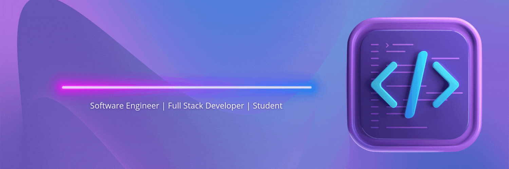

  

<h3 align="center">Connect with me:</h3>

<!--   -->

 

📫 How to reach me:   <a href="mailto:intermediadesignsllc@gmail.com" target="_blank" alt="email">intermediadesignsllc@gmail.com</a>

 

<h2>About Me:</h2>
Currently attending college to finish my Bachelors in Business Administration with a minor in Web and Digital Design. I'm a passionate learner who's always interested in expanding my horizons. I'm currently diving deep into the world of programming, learning various languages to broaden my skill set and understanding. I've been spending my time developing projects, which allows me to apply what I've learned in a practical way. 

  
<h2>🌟 Goals:</h2>

- 🗂️ Develop a desktop application for contract management
  
- 👩🏻‍🏫 Develop a learning website

- 🖥️ Develop a Micro SaaS

- 👩🏻‍💻 Develop Wordpress themes & plugins

 
<h2>🚧 Ongoing Projects:</h2>

- 🔭 I’m currently working on **my web developer portfolio**

- 🌱 I’m currently learning **Python**

- 💬 Ask me about **anything**

 
  
<h2>✅ Projects:</h2>
 

- Pulse Health App - Comprehensive Healthcare Management Platform for Dallas Software Developers Group
  
<a href="https://pulsehealthapp.netlify.app/">Live Site</a>

  
This comprehensive healthcare management web application was developed during a 6-week apprenticeship program with Dallas Software Developers Group. The platform streamlines interactions between patients and healthcare providers, improving appointment scheduling, and digitizing intake and document management—all within a secure, user-friendly interface designed to modernize healthcare accessibility.

  
  

  &nbsp;&nbsp;
  &nbsp;&nbsp;
  &nbsp;&nbsp;
  &nbsp;&nbsp;
  
  

  

  
Project Overview:

   
  <ul>
    <li>Features:</li>
     
      <ul>
        <li><strong>Provider Search & Discovery</strong>: Comprehensive search functionality for healthcare providers with filtering by specialty, location, and ratings.</li>
        <li><strong>Appointment Management</strong>: Complete booking system allowing patients to schedule, reschedule, and manage appointments with healthcare providers.</li>
        <li><strong>Digital Intake Forms</strong>: Streamlined patient intake process with digital forms and document upload capabilities.</li>
        <li><strong>Dual Dashboard System</strong>: Personalized dashboards for both patients and providers with role-specific functionality.</li>
        <li><strong>Secure Authentication</strong>: Robust user authentication system ensuring secure access for patients and healthcare providers.</li>
        <li><strong>File Management System</strong>: Secure upload and management of medical records, insurance documents, and other healthcare files.</li>
        <li><strong>Provider Ratings</strong>: Rating system showcasing top-rated doctors and detailed provider information.</li>
      </ul>
     
    <li>Tech Stack:</li>
     
    <ul>
      <li><strong>Frontend</strong>: Next.js with TypeScript</li>
      <li><strong>Backend</strong>: Appwrite</li>
      <li><strong>Styling</strong>: Tailwind CSS & DaisyUI</li>
      <li><strong>Deployment</strong>: Netlify</li>
    </ul>
     
    <li>Technical Implementation:</li>
   
    <h3>Next.js Frontend</h3>
    <ul>
        <li>Server-side rendering for optimal performance and SEO</li>
        <li>TypeScript integration for enhanced type safety and developer experience</li>
        <li>Modern, responsive UI components including navigation, tables, cards, and modals</li>
        <li>Dynamic routing for seamless user experience across patient and provider workflows</li>
    </ul>
    
    <h3>Appwrite Backend Integration</h3>
    <ul>
        <li>Secure authentication services for multi-role user management</li>
        <li>Database services for storing patient information, appointments, and provider data</li>
        <li>File storage solutions for medical documents and insurance files</li>
        <li>Real-time data synchronization for appointment updates and notifications</li>
    </ul>
    
    <h3>Healthcare-Specific Features</h3>
    <ul>
        <li>HIPAA-compliant data handling and storage practices</li>
        <li>Intuitive appointment scheduling with conflict resolution</li>
        <li>Comprehensive intake form system with conditional logic</li>
        <li>Provider profile management with specialties and availability</li>
    </ul>

    <h3>User Experience Design</h3>
    <ul>
        <li>Responsive design ensuring accessibility across all devices</li>
        <li>Intuitive user interface designed for healthcare accessibility standards</li>
        <li>Role-based navigation optimized for both patients and providers</li>
        <li>Modern component library built with Tailwind CSS and DaisyUI</li>
        <li>Pre-built, customizable UI components for consistent design language</li>
    </ul>
     
    <li>Program Details:</li>
     
    
This project was developed as part of the Dallas Software Developers Group's 6-week apprenticeship program (July 2025 - August 2025), a completely free developer placement program designed to pair developers with industry professionals for hands-on project experience. Guided by seasoned developers, this program focused on equipping participants with real-world skills and creating compelling projects to showcase in interviews.

  </ul>
  
   
  <h2>Conclusion</h2>
  
Pulse Health App addresses critical challenges in modern healthcare management:

  <ul>
    <li><strong>Streamlining Healthcare Access:</strong> By providing an intuitive platform for provider discovery and appointment booking, the application removes barriers to healthcare access.</li>
    <li><strong>Digitizing Healthcare Workflows:</strong> The digital intake forms and document management system modernize traditional paper-based processes, improving efficiency for both patients and providers.</li>
    <li><strong>Enhancing Patient Experience:</strong> The user-centric design prioritizes ease of use, making healthcare management more accessible to users of all technical backgrounds.</li>
    <li><strong>Supporting Provider Efficiency:</strong> The provider dashboard and appointment management tools help healthcare professionals streamline their practice management.</li>
    <li><strong>Ensuring Data Security:</strong> Built with healthcare compliance in mind, the platform prioritizes the security and privacy of sensitive medical information.</li>
    <li><strong>Promoting Healthcare Transparency:</strong> The provider rating system helps patients make informed decisions about their healthcare choices.</li>
  </ul>
   
  
This platform not only demonstrates technical proficiency in modern web development but also showcases the ability to tackle real-world problems in the healthcare industry. The project reflects a deep understanding of both user experience design and the specific challenges facing healthcare management today, positioning it as a meaningful contribution to healthcare technology innovation.

  

   

- Code Sage AI - AI-Assisted Code Review Platform
  
<a href="https://code-sage-ai.vercel.app/">Live Site</a>

  
 This AI-Assisted Code Review Platform is an innovative solution designed to revolutionize the code review process. By leveraging cutting-edge AI technology, it provides intelligent, automated code analysis and suggestions, enhancing code quality and accelerating development cycles.

  
  

  &nbsp;&nbsp;
  &nbsp;&nbsp;
  &nbsp;&nbsp;
  &nbsp;&nbsp;
  &nbsp;&nbsp;
  
  

  

  
Project Overview:

   
  <ul>
    <li>Features:</li>
     
      <ul>
        <li><strong>AI-Powered Code Analysis</strong>: Utilizes Google Gemini to provide intelligent code review suggestions and identify potential issues.</li>
        <li><strong>Real-time Collaboration</strong>: Enables developers to share and review code snippets in real-time.</li>
        <li> <strong>Multi-language Support</strong>: Supports various programming languages for comprehensive code analysis.</li>
        <li><strong>User Authentication</strong>: Secure user accounts and personalized review history.</li>
        <li><strong>Interactive Code Editor</strong>: Feature-rich code editing environment with syntax highlighting.</li>
      </ul>
     
    <li>Tech Stack:</li>
     
    <ul>
      <li><strong>Frontend</strong>: Next.js with TypeScript</li>
      <li><strong>Backend</strong>: Convex</li>
      <li><strong>AI Model</strong>: Google Gemini</li>
      <li><strong>Authentication</strong>: Clerk</li>
      <li><strong>Styling</strong>: Tailwind CSS & Shadcn/UI</li>
    </ul>
     
    <li>Technical Implementation:</li>
   
    <h3>Next.js Frontend</h3>
    <ul>
        <li>App Router for optimized routing and server-side rendering</li>
        <li>TypeScript for enhanced type safety and developer experience</li>
        <li>Monaco Editor integration for a powerful code editing interface</li>
    </ul>
    
    <h3>Convex Backend</h3>
    <ul>
        <li>Real-time data synchronization for collaborative features</li>
        <li>Efficient storage and retrieval of code snippets and review data</li>
        <li>Serverless functions for handling business logic</li>
    </ul>
    
    <h3>Google Gemini Integration</h3>
    <ul>
        <li>Advanced natural language processing for code analysis</li>
        <li>Context-aware suggestions for code improvements</li>
        <li>Multi-language support for diverse development environments</li>
    </ul>

    <h3>Google Gemini Integration</h3>
    <ul>
        <li>Advanced natural language processing for code analysis</li>
        <li>Context-aware suggestions for code improvements</li>
        <li>Multi-language support for diverse development environments</li>
    </ul>

    <h3>Google Gemini Integration</h3>
    <ul>
         <li>Advanced natural language processing for code analysis</li>
         <li>Context-aware suggestions for code improvements</li>
         <li>Multi-language support for diverse development environments</li>
    </ul>
  </ul>
  
   
  <h2>Conclusion</h2>
  
The AI-Assisted Code Review Platform aims to address several key challenges in the software development process:

  <ul>
    <li><strong>Enhancing Code Quality:</strong> By providing AI-driven insights, the platform helps identify and resolve potential issues early in the development cycle.</li>
    <li><strong>Accelerating Development:</strong> Instant AI feedback reduces the time spent on manual code reviews, speeding up the overall development process.</li>
    <li><strong>Promoting Best Practices:</strong> The AI suggestions help developers learn and apply coding best practices consistently across projects.</li>
    <li><strong>Reducing Technical Debt:</strong> Early detection of code issues prevents the accumulation of technical debt over time.</li>
    <li><strong>Augmenting Human Expertise:</strong> By handling routine checks, the AI allows human reviewers to focus on higher-level architectural considerations.</li>
  </ul>
   
  
This platform not only improves code quality and developer productivity but also fosters a culture of continuous learning and improvement in software development teams.

  

   

- AI Customer Support Application for Headstarter SWE Fellowship
  
<a href="https://ai-customer-support-mu.vercel.app/">Live Site</a>

  
This AI Customer Support Application was developed as part of the Headstarter SWE Fellowship. It's an AI-   
  powered chatbot designed to provide intelligent customer support, leveraging modern web technologies and AI 
  capabilities to deliver a personalized chat experience.

  
  

  &nbsp;&nbsp;
  &nbsp;&nbsp;
  &nbsp;&nbsp;
  
  

  

  
Project Overview:

   
  <ul>
    <li>Features:</li>
     
      <ul>
        <li><strong>Intelligent AI Responses</strong>: Utilizes Google Gemini to generate dynamic, context-aware 
        responses to user queries.</li>
        <li><strong>User Authentication</strong>: Personalized chat experiences with secure user authentication.          </li>
        <li><strong>Real-time Interaction</strong>: Instant message display and status indicators for a seamless 
        user experience.</li>
      </ul>
     
    <li>Tech Stack:</li>
     
    <ul>
      <li><strong>Frontend</strong>: Next.js</li>
      <li><strong>Backend & Database</strong>: Firebase</li>
      <li><strong>AI Model</strong>: Google Gemini</li>
    </ul>
     
    <li>Technical Implementation:</li>
   
    <h3>Next.js Frontend</h3>
    <ul>
        <li>Server-side rendering for improved performance and SEO</li>
        <li>Dynamic routing for seamless navigation</li>
        <li>API routes for serverless backend functionality</li>
    </ul>
    
    <h3>Firebase Integration</h3>
    <ul>
        <li>Realtime Database/Firestore for data storage</li>
        <li>Firebase Authentication for user management</li>
        <li>Cloud Functions for serverless operations</li>
    </ul>
    
    <h3>Google Gemini Integration</h3>
    <ul>
        <li>API integration for processing user inputs and generating responses</li>
        <li>Context management system for coherent conversations</li>
        <li>Error handling and fallback mechanisms</li>
    </ul>
     
    <li>Contributors:</li>
     
    
This project was developed as part of the Headstarter SWE Fellowship. Contributors include:

    
    <h3>Frontend & Backend</h3>
      <ul>
        <li><a href="https://github.com/IntermediaDesigns">Lynjai Jimenez</a></li>
      </ul>
    <h3>Frontend UI</h3>
      <ul>
        <li><a href="https://github.com/Calypso90">Calypso Hernandez</a></li>
      </ul>
  </ul>
   
  <h2>Conclusion</h2>
  
This project showcases my proficiency in developing advanced web applications using cutting-edge technologies. Specifically, it demonstrates:

  <ul>
    <li><strong>Full-stack Development Skills:</strong> Utilizing Next.js for a robust frontend and Firebase for a scalable backend, showcasing a comprehensive understanding of modern web development practices.</li>
    <li><strong>AI Integration:</strong> Successfully implementing Google Gemini for intelligent responses, highlighting my ability to work with and integrate advanced AI models into practical applications.</li>
    <li><strong>User Authentication and Security:</strong> Implementing secure user authentication and data protection measures, demonstrating a strong focus on application security and user privacy.</li>
    <li><strong>Real-time Features:</strong> Developing real-time interaction capabilities, showcasing skills in creating responsive and dynamic user experiences.</li>
    <li><strong>Problem-Solving Abilities:</strong> Addressing challenges such as AI response latency and context retention, illustrating my capacity to find innovative solutions to complex technical problems.</li>
    <li><strong>UI/UX Considerations:</strong> Creating an intuitive and user-friendly interface for the chatbot, showing an understanding of the importance of user experience in application design.</li>
  </ul>
   
  
This AI Customer Support Application not only serves as a practical solution for enhancing customer support processes but also as a testament to my capabilities as a developer. It reflects my ability to leverage modern technologies to create innovative, efficient, and user-centric applications.

  

   

- Flash Wave a Flashcard SaaS Application for Headstarter SWE Fellowship
  
<a href="https://flashwave-zeta.vercel.app/">Live Site</a>

  
This Flashcard SaaS Application was developed as part of the Headstarter SWE Fellowship. Flash Wave is a cutting-edge flashcard 
  application that revolutionizes the way you learn and retain information. Powered by advanced AI technology and built on a robust 
  tech stack, Flash Wave offers a seamless, personalized learning experience for students, professionals, and lifelong learners alike. 
  

  
  

  &nbsp;&nbsp;
  &nbsp;&nbsp;
  &nbsp;&nbsp;
  &nbsp;&nbsp;
  &nbsp;&nbsp;
    
  

  

  
Project Overview:

   
  <ul>
    <li>Features:</li>
     
      <ul>
        <li>AI-powered flashcard generation</li>
        <li>Personalized learning paths</li>
        <li>Multiple subscription tiers (Free, Basic, Pro)</li>
        <li>Intuitive user interface</li>
        <li>Progress tracking and analytics</li>
        <li>Secure authentication with Clerk</li>
        <li>Seamless payment integration with Stripe</li>
      </ul>
       
      <li>Tech Stack:</li>
       
      <ul>
        <li><strong>Frontend:</strong> Next.js</li>
        <li><strong>Backend:</strong> Firebase</li>
        <li><strong>Authentication:</strong> Clerk</li>
        <li><strong>AI Integration:</strong> OpenAI</li>
        <li><strong>Payment Processing:</strong> Stripe</li>
      </ul>
       
      <li>Technical Implementation:</li>
      <h3>Next.js Frontend</h3>
      <ul>
        <li>Server-side rendering for improved performance and SEO</li>
        <li>Dynamic routing for seamless navigation</li>
        <li>API routes for serverless backend functionality</li>
     </ul>
     <h3>Clerk Authentication</h3>
     <ul>
        <li>Secure user authentication and management</li>
        <li>Seamless integration with Next.js</li>
        <li>Support for multiple authentication methods</li>
     </ul>
     <h3>Firebase Integration</h3>
     <ul>
        <li>Realtime Database/Firestore for data storage</li>
        <li>Cloud Functions for serverless operations</li>
        <li>Scalable backend infrastructure</li>
     </ul>
     <h3>Stripe Payment Integration</h3>
     <ul>
        <li>Secure payment processing for subscription tiers</li>
        <li>Webhook integration for handling payment events</li>
        <li>Customer portal for managing subscriptions</li>
     </ul>
     <h3>OpenAI Integration</h3>
     <ul>
        <li>AI-powered flashcard generation</li>
        <li>Natural language processing for content optimization</li>
        <li>Personalized learning recommendations</li>
     </ul>
      
     <li>Contributors:</li>
      
     
This project was developed as part of the Headstarter SWE Fellowship. Contributors include:

     <h3>Frontend & Backend</h3>
       <ul>
         <li><a href="https://github.com/IntermediaDesigns">Lynjai Jimenez</a></li>
       </ul>
     <h3>Frontend UI</h3>
       <ul>
         <li><a href="https://github.com/Calypso90">Calypso Hernandez</a></li>
       </ul>
  </ul>
   
  <h2>Conclusion</h2>
  
This project showcases proficiency in developing advanced web applications using cutting-edge technologies. Specifically, it demonstrates:

  <ul>
    <li><strong>Full-stack Development Skills:</strong> Utilizing Next.js for a robust frontend and Firebase for a scalable backend, showcasing a comprehensive understanding of modern web development practices.</li>
    <li><strong>AI Integration:</strong> Successfully implementing Google Gemini for intelligent responses, highlighting the ability to work with and integrate advanced AI models into practical applications.</li>
    <li><strong>User Authentication and Security:</strong> Implementing secure user authentication and data protection measures, demonstrating a strong focus on application security and user privacy.</li>
    <li><strong>Real-time Features:</strong> Developing real-time interaction capabilities, showcasing skills in creating responsive and dynamic user experiences.</li>
    <li><strong>Problem-Solving Abilities:</strong> Addressing challenges such as AI response latency and context retention, illustrating the capacity to find innovative solutions to complex technical problems.</li>
    <li><strong>UI/UX Considerations:</strong> Creating an intuitive and user-friendly interface for the chatbot, showing an understanding of the importance of user experience in application design.</li>
  </ul>
   
  
Flash Wave not only serves as a practical solution for enhancing learning processes but also as a testament to the developers' capabilities. It reflects the ability to leverage modern technologies to create innovative, 
  efficient, and user-centric applications.

  

   

- Mentor Metrics AI-Powered Professor Rating and Recommendation System Application for Headstarter SWE Fellowship
  
<a href="https://mentor-metrics.vercel.app/">Live Site</a>

  
Mentor Metrics is an innovative AI-powered application that revolutionizes the way students access and 
  interpret professor ratings. Built with cutting-edge technologies, this project aims to provide personalized, 
  intelligent insights into professor performance and suitability.

  
  

    &nbsp;&nbsp;
    &nbsp;&nbsp;
    &nbsp;&nbsp;
    &nbsp;&nbsp;
    
  

  

  
Project Overview:

   
  <ul>
    <li>Features:</li>
     
      <ul>
        <li>AI-powered professor rating analysis</li>
        <li>Automated web scraping of Rate My Professor pages</li>
        <li>Advanced search and personalized professor recommendations</li>
        <li>User-friendly interface for submitting new professor data</li>
        <li>Real-time data updates and analysis</li>
      </ul>
     
    <li>Tech Stack:</li>
     
    <ul>
      <li><strong>Frontend:</strong> Next.js</li>
      <li><strong>AI Integration:</strong> OpenAI</li>
      <li><strong>Vector Database:</strong> Pinecone</li>
      <li><strong>Web Scraping:</strong> Cheerio</li>
    </ul>
     
    <li>Technical Implementation:</li>
    <h3>Next.js Frontend</h3>
    <ul>
      <li>Server-side rendering for improved performance and SEO</li>
      <li>Dynamic routing for seamless navigation</li>
      <li>API routes for serverless backend functionality</li>
    </ul>
    <h3>OpenAI Integration</h3>
    <ul>
      <li>Natural language processing for analyzing professor reviews</li>
      <li>AI-powered recommendation system</li>
      <li>Context-aware query understanding and response generation</li>
    </ul>
    <h3>Pinecone Integration</h3>
    <ul>
      <li>Vector storage for efficient similarity search</li>
      <li>Real-time data updates and retrieval</li>
      <li>Scalable architecture for handling large datasets</li>
    </ul>
    <h3>Web Scraping Module</h3>
    <ul>
      <li>Automated data extraction from Rate My Professor pages</li>
      <li>Data cleaning and preprocessing</li>
      <li>Integration with Pinecone for real-time database updates</li>
    </ul>
     
    <li>Contributors:</li>
     
    
This project was developed as part of the Headstarter SWE Fellowship. Contributors include:

    <h3>Frontend & Backend</h3>
      <ul>
        <li><a href="https://github.com/IntermediaDesigns">Lynjai Jimenez</a></li>
      </ul>
    <h3>Frontend UI</h3>
      <ul>
        <li><a href="https://github.com/Calypso90">Calypso Hernandez</a></li>
      </ul>
  </ul>
   
  <h2>Conclusion</h2>
  
Mentor Metrics demonstrates proficiency in developing advanced AI-powered web applications. Key highlights include:

  <ul>
    <li><strong>AI Integration:</strong> Leveraging OpenAI for intelligent analysis and recommendations, showcasing the ability to work with cutting-edge AI technologies.</li>
    <li><strong>Vector Database Implementation:</strong> Utilizing Pinecone for efficient data storage and retrieval, demonstrating skills in working with modern, specialized databases.</li>
    <li><strong>Web Scraping and Data Processing:</strong> Implementing automated data collection and processing, highlighting capabilities in handling and structuring large datasets.</li>
    <li><strong>Full-stack Development:</strong> Building a comprehensive application with Next.js, combining frontend and backend technologies for a seamless user experience.</li>
    <li><strong>Scalable Architecture:</strong> Designing a system capable of handling growing datasets and user bases, showcasing foresight in application architecture.</li>
  </ul>
   
  
Mentor Metrics not only serves as a valuable tool for students seeking professor information but also demonstrates the developers' ability to create innovative, AI-driven solutions to real-world problems.

  

   

- Pantry Pro - AI-Powered Pantry Management Application for Headstarter SWE Fellowship
  
<a href="https://pantry-tracker-plum.vercel.app/">Live Site</a>

  
Pantry Pro is an innovative pantry management application developed as a solo project. It leverages modern 
  web technologies and AI capabilities to provide a seamless and intelligent solution for managing your kitchen 
  inventory and meal planning.

  
  

  &nbsp;&nbsp;
  &nbsp;&nbsp;
  &nbsp;&nbsp;
  &nbsp;&nbsp;
  
  

  

  
Project Overview:

   
  <ul>
    <li>Features:</li>
     
    <ul>
        <li><strong>Pantry Management</strong>: Add, delete, and update pantry items with ease.</li>
        <li><strong>Smart Search</strong>: Quickly find items in your pantry with advanced search and filter functionality.</li>
        <li><strong>Grocery List</strong>: Save items directly to your grocery list for convenient shopping.</li>
        <li><strong>Favorites</strong>: Mark and easily access your favorite pantry items.</li>
        <li><strong>AI-Powered Recipe Suggestions</strong>: Get personalized recipe ideas based on your pantry contents.</li>
        <li><strong>Image Generation</strong>: Automatically generate and update item images using AI.</li>
    </ul>
     
    <li>Tech Stack:</li>
     
    <ul>
      <li><strong>Frontend</strong>: Next.js, Tailwind CSS</li>
      <li><strong>Backend & Database</strong>: Firebase</li>
      <li><strong>AI Integration</strong>: Hugging Face API (image generation), Google Gemini API (recipe suggestions)</li>
      <li><strong>Deployment</strong>: Vercel with CI/CD</li>
    </ul>
     
    <li>Technical Implementation:</li>
    <h3>Next.js Frontend</h3>
    <ul>
        <li>Server-side rendering for improved performance and SEO</li>
        <li>Dynamic routing for seamless navigation</li>
        <li>Responsive design using Tailwind CSS</li>
    </ul>

    <h3>Firebase Integration</h3>
    <ul>
        <li>Realtime Database for storing pantry items and user data</li>
        <li>Firebase Authentication for user management</li>
        <li>Cloud Storage for storing generated item images</li>
    </ul>

    <h3>AI Integration</h3>
    <ul>
        <li>Hugging Face API for generating realistic item images</li>
        <li>Google Gemini API for intelligent recipe suggestions based on pantry contents</li>
    </ul>

    <h3>CI/CD Pipeline</h3>
    <ul>
        <li>Automated deployment to Vercel upon pushing to the main branch</li>
        <li>Continuous integration checks to ensure code quality and prevent breaking changes</li>
    </ul>
    </ul>
     
  <h2>Conclusion</h2>
  
Pantry Pro showcases advanced web development skills and the innovative use of AI in practical applications. Key highlights include:

  <ul>
      <li><strong>Full-stack Development</strong>: Utilizing Next.js and Tailwind CSS for a robust frontend, with Firebase powering the backend.</li>
      <li><strong>AI Integration</strong>: Leveraging Hugging Face for image generation and Google Gemini for intelligent recipe suggestions.</li>
      <li><strong>Real-time Features</strong>: Implementing real-time updates for a responsive user experience.</li>
      <li><strong>Scalable Architecture</strong>: Designing a system capable of handling growing user bases and data volumes.</li>
      <li><strong>User-Centric Design</strong>: Focusing on intuitive UI/UX to enhance user engagement and satisfaction.</li>
  </ul>
  
Pantry Pro not only simplifies pantry management but also demonstrates the potential of combining modern web technologies with AI to create practical, user-friendly applications.

  

   

<h2>☑️ Challenges</h2>

- Advice generator app for <a href="https://www.frontendmentor.io/challenges/advice-generator-app-QdUG-13db" target="_blank">Frontend Mentor</a> - See my app here: <a href="https://advicegenappchallenge.netlify.app/" target="_blank">Advice Generator App</a>
  
Challenge done with Next JS, no extra add ons such as tailwind. The challenge is to build out this advice generator app using the Advice Slip API and get it looking as close to the design as possible.

  

  
Skills & Features

   
  <ul>
    <li>HTML</li>
    <li>JavaScript</li>
    <li>Vanilla CSS</li>
    <li>React</li>
    <li>Next js</li>
    <li>Netlify</li>
    <li>API</li>
  </ul>

- 100 Days of Python Code using Replit <a href="hhttps://github.com/IntermediaDesigns/100-days-of-python" target="_blank">Replit Profile</a> 
  
During the 100 Days, I learned frontend implementing flask, build games, apps, and websites by mastering Python programming.

  

  
Skills & Features

   
  <ul>
    <li>HTML</li>
    <li>JavaScript</li>
    <li>Vanilla CSS</li>
    <li>Flask</li>
    <li>Python</li>
    <li>Replit</li>
  </ul>

 

<h2 align="left">💻 Languages and Tools:</h2>

<table style="width: 100%; border-collapse: collapse; border: none; margin: 0; padding: 0; align: center;">
  <tr style="border: none;">
    <td width="20%" style="border: none; vertical-align: top; padding: 0;">
      

      

      

      

      

      

      

      

      

    </td>
    <td width="20%" style="border: none; vertical-align: top; padding: 0;">
      

      

      

      

      

      

      

    </td>
    <td width="20%" style="border: none; vertical-align: top; padding: 0;">
      

      

      

      

      

      

    </td>
    <td width="20%" style="border: none; vertical-align: top; padding: 0;">
      

      

      

      

      

        

      

    </td>
    <td width="20%" style="border: none; vertical-align: top; padding: 0;">
      

      

      

      

      

      

      

    </td>
  </tr>
</table>

 

<h2> Credly Badges</h2>

 

<h2>📊GitHub Stats:</h2>

  
      
  
      
  

  

<h1 align="center">Thank you for visiting my profile!</h1>
<h2 align="center">Support Me ☕:</h2>

  
